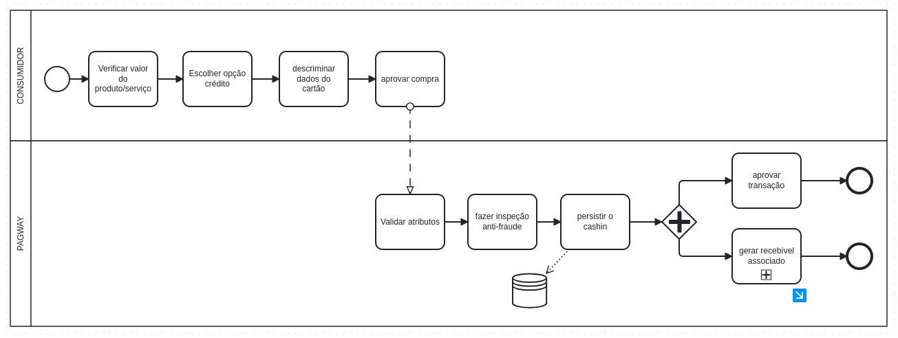
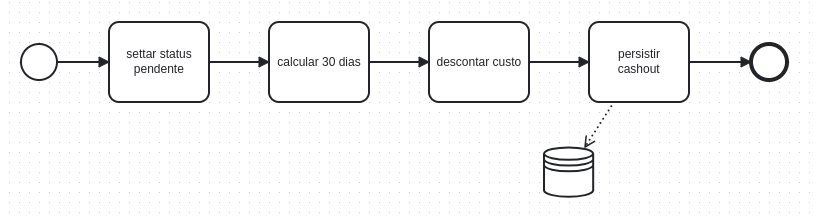

# ressalvas
Foram tomados alguns pressupostos:
- o cliente do cliente é o consumidor, provavelmente o dono do cartão.
- apenas o consumidor detém os dados do cartão, nunca o cliente.

O _consumidor_ ao pagar uma _compra_ com cartão gera **processar transação**

A aplicação deve funcionar para vários clientes, cada um em seu _tenant_. Mas pra simplificar o desafio se pressupẽm um único cliente estático oculto.

# processo "usuário compra com cartão"

## subprocesso "recebível persistido"

Há casos que existe o processo de compra mas que não se gera um recebível, por exemplo limite insuficiente.