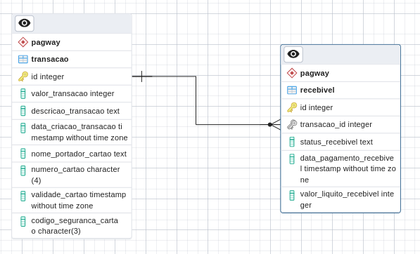
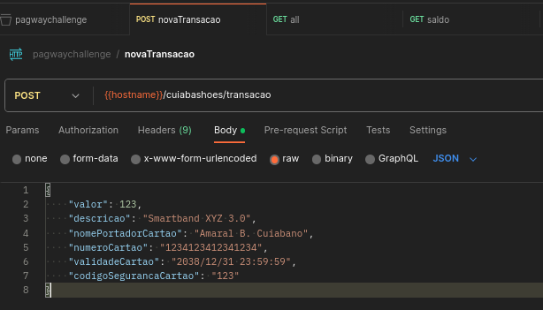
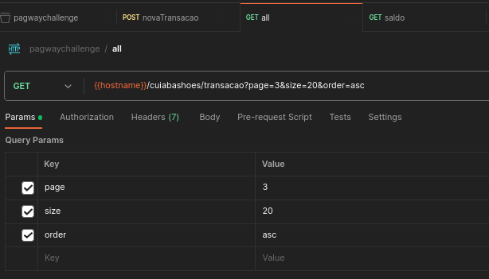
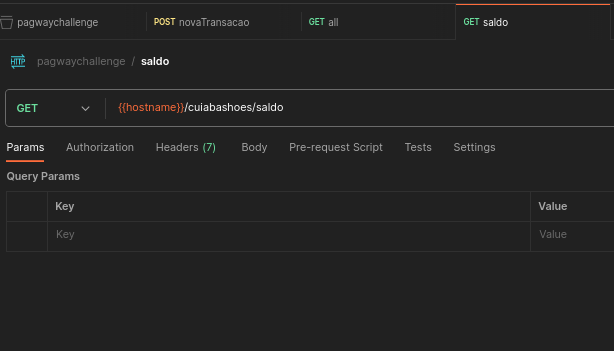

# ressalvas
Foram tomados alguns pressupostos:
- o cliente do cliente é o consumidor, provavelmente o dono do cartão.
- apenas o consumidor detém os dados do cartão, nunca o cliente.

O _consumidor_ ao pagar uma _compra_ com cartão gera **processar transação**

A aplicação deve funcionar para vários clientes, cada um em seu _tenant_. Mas pra simplificar o desafio se pressupẽm um único cliente estático oculto.

# processo "usuário compra com cartão"


## subprocesso "recebível persistido"


Há casos que existe o processo de compra mas que não se gera um recebível, por exemplo limite insuficiente.

# Tabelas
A tabela _transacao_ (cashin) possui as colunas:
- valor_transacao
- descricao_transacao
- data_criacao_transacao

e também:
- nome_portador_cartao
- numero_cartao
- validade_cartao
- codigo_seguranca_cartao

cada transação pode ter 0 ou apenas 1 recebível. Os arquivos sql dentro da pasta [initdb.d](./initdb.d/) são utilizados para inicializar o banco.



# Rotas

São necessárias 3 rotas, uma para criar uma nova transação e recebendo um json desta forma:
```json
{
    "valor": 123,
    "descricao": "Smartband XYZ 3.0",
    "nomePortadorCartao": "Amaral B. Cuiabano",
    "numeroCartao": "1234123412341234",
    "validadeCartao": "2038/12/31 23:59:59",
    "codigoSegurancaCartao": "123"
}
```


Uma outra rota para listar todas as transações registradas:


E por último uma rota que calcula o saldo disponível e o prevista:


restornando um json desta forma:
```json
{
  "saldo": {
    "disponivel": 0,
    "previsto": 4200
  }
}
```

destacando que os valores estão em centavos e são sempre números inteiros. Nas 3 rotas utilizou na url `cuiabashoes` estático para designar um cliente fixo.